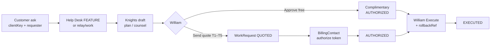

# Customer Change Request Flow

How a property asks for a product change, how Company OS identifies who is asking, how price is computed, and how William gates execution.

**Route (operator):** `/help-desk`  
**Price source of truth:** `src/lib/pricing.ts`  
**Guided test:** Help Desk → **Simulate customer change request**

---

## 1. Who is asking

| Field | Where | Meaning |
|---|---|---|
| `clientKey` | `WorkRequest.clientKey`, `HelpTicket.clientKey`, `SupportClient.clientKey` | Opaque deployment / install id. Product stays hidden — this is the stable machine key, not a guest identity. |
| `SupportClient.label` / `property` | `support_clients` | Optional human-readable label (e.g. “Test Property — Miccosukee Kitchen”) and property grouping. Created/upserted when diagnostics or admin intake know the install. |
| `requesterName` / `requesterRole` | `WorkRequest` (both); `HelpTicket.requesterName` only | Who at the property asked (e.g. Giovanni / GM). **Not** the spend gate. |
| `BillingContact` + `token` | `billing_contacts` | The only profile allowed to authorize **paid** spend for that `clientKey`. Token is the credential presented to `POST /api/relay/work/:id/authorize`. |
| William (admin session) | NextAuth `dr_os` | Always the final **execute** gate. Sets tier/quote, Approve free, and Execute (with mandatory `rollbackRef`). |

**Rule of thumb:** requester ≠ billing contact ≠ William. Anyone can ask; only BillingContact can authorize a charge; only William can Execute.

---

## 2. What’s coded vs not

| Capability | Status | Where |
|---|---|---|
| Help Desk tickets (text / voice / FEATURE) | **In Company OS** | `/help-desk`, `HelpTicket` + messages |
| Linked `WorkRequest` (FIX / ADDON) | **In Company OS** | FEATURE spawn + Support Change Requests panel |
| Pricing (T1–T5, floors, quote freeze) | **In Company OS** | `src/lib/pricing.ts`, `POST /api/work/:id/quote` |
| Knights draft (plan / answer) | **In Company OS** | Help Desk Ask Knights; `POST /api/work/:id/draft` |
| Approve free / Send quote | **In Company OS** | Help Desk + Work panel |
| BillingContact authorize | **In Company OS** | `POST /api/relay/work/:id/authorize` (+ admin test helper) |
| William Execute + `rollbackRef` | **In Company OS** | `POST /api/work/:id/execute` |
| Product “Ask from inside EchoAurion” UI | **Not wired** | Relay **API contracts** exist (`docs/RELAY_CONTRACTS.md`, `/api/relay/work`) — product client does not call them yet |
| Admin-simulated intake | **Test path** | `POST /api/help-desk/test-scenario` + Help Desk button |

Until the product client is wired, William runs the guided test as **admin-simulated intake** (same models and gates as production).

---

## 3. Price structure

**File:** `src/lib/pricing.ts`

```
Quote = WORK_SENIOR_RATE × humanHours × WORK_VALUE_MULTIPLIER × tierMultiplier
total = max(floor, ceil(raw))
```

Defaults when env unset: `WORK_SENIOR_RATE = 185`, `WORK_VALUE_MULTIPLIER = 2.5`.

| Tier | Label | Description | × | Default hrs | Floor (USD) | Manual review |
|---|---|---|---|---|---|---|
| T1 | Trivial | Config change, copy edit, toggle | 1.0 | 1 | $500 | No |
| T2 | Minor | Small field, report tweak, simple UI | 1.25 | 2 | $900 | No |
| T3 | Standard | New screen or feature | 1.5 | 5 | $2,000 | No |
| T4 | Complex | Data-model or new integration | 1.75 | 12 | $6,000 | Yes |
| T5 | Major | Bespoke / architectural | 2.0 | 30 | $15,000 | Yes |

Example T2 at defaults: `185 × 2 × 2.5 × 1.25 = 1,156.25` → ceil → **$1,157**, above $900 floor → billed **$1,157**.

Quote is frozen on `WorkRequest` (`tier`, `humanHours`, `quoteTotal`, `quoteSnapshot`) at quote time so the billing contact authorizes an immutable amount.

---

## 4. Flow diagram



Two-key charge path: **BillingContact authorize** + **William Execute**. Complimentary path: William Approve free (sets both keys) then Execute still requires `rollbackRef`.

---

## 5. Guided test (5 clicks after redeploy)

1. Open **Help Desk** (`/help-desk`).
2. Click **Simulate customer change request** — seeds `SupportClient` (`test-miccosukee-kitchen`), FEATURE ticket, linked ADDON `WorkRequest` (Giovanni / GM), and a test BillingContact.
3. On the checklist: **Ask Knights** → review draft → **Send quote (T2)** *(or Approve free)*.
4. If quoted: **Simulate billing authorize**.
5. **Execute** with rollback ref `test-rollback-001`.

API: `POST /api/help-desk/test-scenario` (auth) seeds atomically + audit `help_desk.test_scenario.seed`.  
Authorize helper: `POST /api/help-desk/test-scenario` body `{ "action": "authorize", "workRequestId": "…" }`.

---

## Related

- `docs/HELP_DESK.md` — operator workspace
- `docs/RELAY_CONTRACTS.md` — product ↔ Company OS stubs
- Support Change Requests panel — quote / execute UI for all work items
